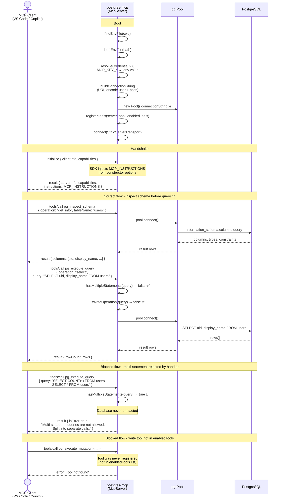

> 🌐 **English** | [Português](ARCHITECT_PT.md)

# Architecture

This document describes the communication flow between a MCP client and PostgreSQL when using `@edelciomolina/postgres-mcp`.

## Overview

`@edelciomolina/postgres-mcp` is a **native MCP server** built with [`@modelcontextprotocol/sdk`](https://www.npmjs.com/package/@modelcontextprotocol/sdk) and [`pg`](https://www.npmjs.com/package/pg) (node-postgres). There is no child process or NDJSON proxy - the MCP protocol and database connectivity are handled directly.

| Responsibility | Where |
|---|---|
| Credential resolution from `.env` with configurable key mapping | Boot |
| Instructions delivered to the client | `initialize` response (via SDK constructor option) |
| Multi-statement and write-operation guard | Inside `pg_execute_query` handler |
| Tool filtering | Selective tool registration at boot |

---

## Communication Flow

---

## Key design decisions

### 1. Native MCP server
The server uses `@modelcontextprotocol/sdk`'s `McpServer` class with `StdioServerTransport`. There is no child process or NDJSON proxy. The MCP protocol is handled natively by the SDK, keeping the codebase simple and removing a runtime dependency.

### 2. Instructions via SDK constructor
`MCP_INSTRUCTIONS` is passed to `new McpServer({ name, version }, { instructions })`. The SDK injects it into the `initialize` response automatically - no manual message interception or JSON patching needed.

### 3. Guards inside tool handlers
The multi-statement check (`hasMultipleStatements`) and write-operation check (`isWriteOperation`) live inside the `pg_execute_query` handler function. If either check fails, the handler returns an error result immediately - the database is never contacted and no extra interception layer is needed.

### 4. Selective tool registration
Only the tools present in `enabledTools` are registered on the `McpServer` at boot. Calling a tool that was not registered returns the SDK's standard "tool not found" error. There is no runtime disabled-tool guard; the filtering happens once, at startup.

### 5. Credential isolation
Credentials never appear in MCP tool arguments or MCP messages. They are resolved at boot from a `.env` file, URL-encoded into a connection string, and passed to a `pg.Pool` instance. Key names can be remapped via `MCP_KEY_*` environment variables, allowing the same `.env` to serve multiple services without duplication.

### 6. Read-only by default
`DEFAULT_READONLY_TOOLS` contains only tools that perform pure read operations: `pg_execute_query`, `pg_manage_query`, `pg_inspect_schema`, `pg_get_setup_instructions`, `pg_analyze_database`, `pg_monitor_database`, and `pg_debug_database`. All `pg_manage_*` tools that can execute DDL or DML (`pg_manage_schema`, `pg_manage_indexes`, `pg_manage_constraints`, `pg_manage_functions`, `pg_manage_triggers`, `pg_manage_rls`, `pg_manage_users`) plus `pg_execute_mutation` and `pg_execute_sql` are in `WRITE_CAPABLE_TOOLS` and are never exposed by default. Write access requires explicitly passing `tool=<name>` arguments at startup **and** setting `POSTGRES_MCP_ALLOW_WRITE=true` in the environment.
