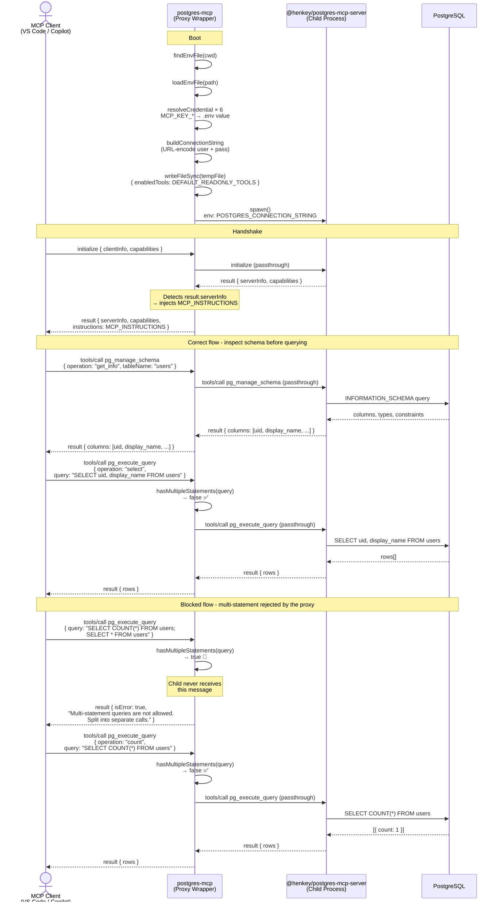

> 🌐 **English** | [Português](ARCHITECT_PT.md)

# Architecture

This document describes the communication flow between a MCP client and PostgreSQL when using `@edelciomolina/postgres-mcp`.

## Overview

`@edelciomolina/postgres-mcp` is a **proxy wrapper** that sits between the MCP client and the underlying `@henkey/postgres-mcp-server`. It adds three responsibilities that the child server does not handle:

| Responsibility | Where |
|---|---|
| Credential resolution from `.env` with configurable key mapping | Boot |
| Instruction injection into the MCP handshake | `initialize` response |
| Multi-statement query guard | Every `pg_execute_query` call |

---

## Communication Flow

---

## Key design decisions

### 1. Proxy over fork
The wrapper spawns the child with `stdio: ["pipe", "pipe", "inherit"]`, giving it full control over stdin/stdout while letting stderr flow directly to the terminal. This enables interception without re-implementing the MCP protocol.

### 2. Instructions injected at handshake
The `initialize` response is the only message the proxy **modifies**. It appends `MCP_INSTRUCTIONS` to `result.instructions`, which the client reads once at startup. This guides the model to:
- Always call `pg_manage_schema` before referencing column names
- Never send multiple SQL statements in a single `pg_execute_query` call
- Use `operation="count"` for row counts

### 3. Multi-statement guard on the hot path
Every `tools/call` to `pg_execute_query` is inspected before being forwarded. If `hasMultipleStatements()` returns `true`, the proxy returns an MCP error response directly - the child process is never involved. String literals containing `;` are stripped before the check to avoid false positives (e.g. `WHERE name = 'a;b'`).

### 4. Credential isolation
Credentials never appear in MCP tool arguments or tool configs. They are resolved at boot from a `.env` file, encoded into a connection string, and injected as `POSTGRES_CONNECTION_STRING` into the child's environment. The key names can be remapped via `MCP_KEY_*` environment variables, allowing the same `.env` to serve multiple services without duplication.

### 5. Read-only by default
`DEFAULT_READONLY_TOOLS` omits all write/DDL tools (`pg_execute_mutation`, `pg_execute_sql`). Write access requires explicitly passing `tool=<name>` arguments at startup.
