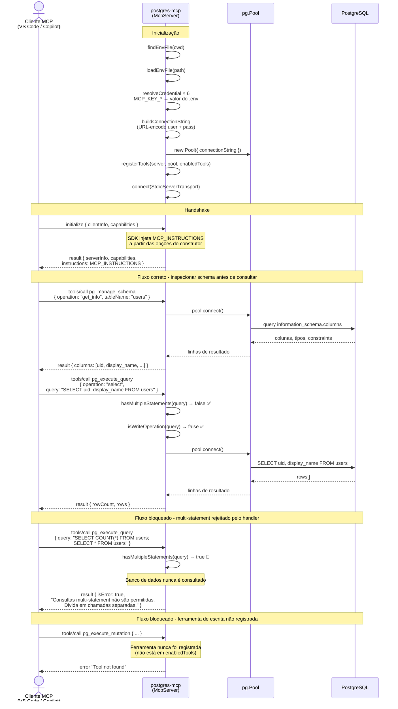

> 🌐 [English](ARCHITECT.md) | **Português**

# Arquitetura

Este documento descreve o fluxo de comunicação entre um cliente MCP e o PostgreSQL ao usar o `@edelciomolina/postgres-mcp`.

## Visão Geral

O `@edelciomolina/postgres-mcp` é um **servidor MCP nativo** construído com [`@modelcontextprotocol/sdk`](https://www.npmjs.com/package/@modelcontextprotocol/sdk) e [`pg`](https://www.npmjs.com/package/pg) (node-postgres). Não há processo filho ou proxy NDJSON — o protocolo MCP e a conectividade com o banco de dados são tratados diretamente.

| Responsabilidade | Quando |
|---|---|
| Resolução de credenciais do `.env` com mapeamento configurável de chaves | Inicialização |
| Instruções entregues ao cliente | Resposta do `initialize` (via opção do construtor do SDK) |
| Proteção contra multi-statement e operações de escrita | Dentro do handler `pg_execute_query` |
| Filtragem de ferramentas | Registro seletivo de ferramentas na inicialização |

---

## Fluxo de Comunicação

---

## Decisões de design

### 1. Servidor MCP nativo
O servidor usa a classe `McpServer` do `@modelcontextprotocol/sdk` com `StdioServerTransport`. Não há processo filho ou proxy NDJSON. O protocolo MCP é tratado nativamente pelo SDK, mantendo o código simples e eliminando uma dependência de execução.

### 2. Instruções via construtor do SDK
`MCP_INSTRUCTIONS` é passado para `new McpServer({ name, version }, { instructions })`. O SDK o injeta na resposta do `initialize` automaticamente — sem necessidade de interceptar mensagens ou fazer patch manual em JSON.

### 3. Guards dentro dos handlers das tools
As verificações de multi-statement (`hasMultipleStatements`) e de operação de escrita (`isWriteOperation`) ficam dentro da função handler de `pg_execute_query`. Se alguma delas falhar, o handler retorna um resultado de erro imediatamente — o banco de dados nunca é consultado e não é necessária nenhuma camada extra de interceptação.

### 4. Registro seletivo de ferramentas
Apenas as ferramentas presentes em `enabledTools` são registradas no `McpServer` durante a inicialização. Chamar uma ferramenta não registrada retorna o erro padrão "tool not found" do SDK. Não há guard de ferramentas desabilitadas em tempo de execução; a filtragem ocorre uma única vez, na inicialização.

### 5. Isolamento de credenciais
As credenciais nunca aparecem nos argumentos das tools MCP ou nas mensagens MCP. Elas são resolvidas na inicialização a partir de um arquivo `.env`, codificadas em URL em uma connection string e passadas para uma instância de `pg.Pool`. Os nomes das chaves podem ser remapeados via variáveis de ambiente `MCP_KEY_*`, permitindo que o mesmo `.env` sirva múltiplos serviços sem duplicação.

### 6. Somente leitura por padrão
`DEFAULT_READONLY_TOOLS` omite as ferramentas de escrita (`pg_execute_mutation`, `pg_execute_sql`). O acesso de escrita requer a passagem explícita de argumentos `tool=<nome>` na inicialização.
