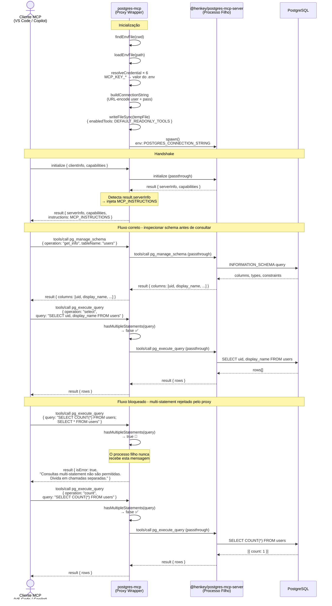

> 🌐 [English](ARCHITECT.md) | **Português**

# Arquitetura

Este documento descreve o fluxo de comunicação entre um cliente MCP e o PostgreSQL ao usar o `@edelciomolina/postgres-mcp`.

## Visão Geral

O `@edelciomolina/postgres-mcp` é um **proxy wrapper** que fica entre o cliente MCP e o `@henkey/postgres-mcp-server` subjacente. Ele adiciona três responsabilidades que o servidor filho não trata:

| Responsabilidade | Quando |
|---|---|
| Resolução de credenciais do `.env` com mapeamento configurável de chaves | Inicialização |
| Injeção de instruções no handshake MCP | Resposta do `initialize` |
| Proteção contra consultas multi-statement | Toda chamada a `pg_execute_query` |

---

## Fluxo de Comunicação

---

## Decisões de design

### 1. Proxy ao invés de fork
O wrapper inicializa o processo filho com `stdio: ["pipe", "pipe", "inherit"]`, dando controle total sobre stdin/stdout enquanto deixa o stderr fluir diretamente para o terminal. Isso permite a interceptação sem reimplementar o protocolo MCP.

### 2. Instruções injetadas no handshake
A resposta do `initialize` é a única mensagem que o proxy **modifica**. Ele acrescenta `MCP_INSTRUCTIONS` em `result.instructions`, que o cliente lê uma vez na inicialização. Isso orienta o modelo a:
- Sempre chamar `pg_manage_schema` antes de referenciar nomes de colunas
- Nunca enviar múltiplas instruções SQL em uma única chamada `pg_execute_query`
- Usar `operation="count"` para contagem de linhas

### 3. Proteção contra multi-statement no caminho crítico
Toda chamada `tools/call` para `pg_execute_query` é inspecionada antes de ser encaminhada. Se `hasMultipleStatements()` retornar `true`, o proxy retorna uma resposta de erro MCP diretamente - o processo filho nunca é envolvido. Literais de string contendo `;` são removidos antes da verificação para evitar falsos positivos (ex.: `WHERE name = 'a;b'`).

### 4. Isolamento de credenciais
As credenciais nunca aparecem nos argumentos ou configurações de ferramentas MCP. Elas são resolvidas na inicialização a partir de um arquivo `.env`, codificadas em uma string de conexão e injetadas como `POSTGRES_CONNECTION_STRING` no ambiente do processo filho. Os nomes das chaves podem ser remapeados via variáveis de ambiente `MCP_KEY_*`, permitindo que o mesmo `.env` sirva múltiplos serviços sem duplicação.

### 5. Somente leitura por padrão
`DEFAULT_READONLY_TOOLS` omite todas as ferramentas de escrita/DDL (`pg_execute_mutation`, `pg_execute_sql`). O acesso de escrita requer a passagem explícita de argumentos `tool=<nome>` na inicialização.
